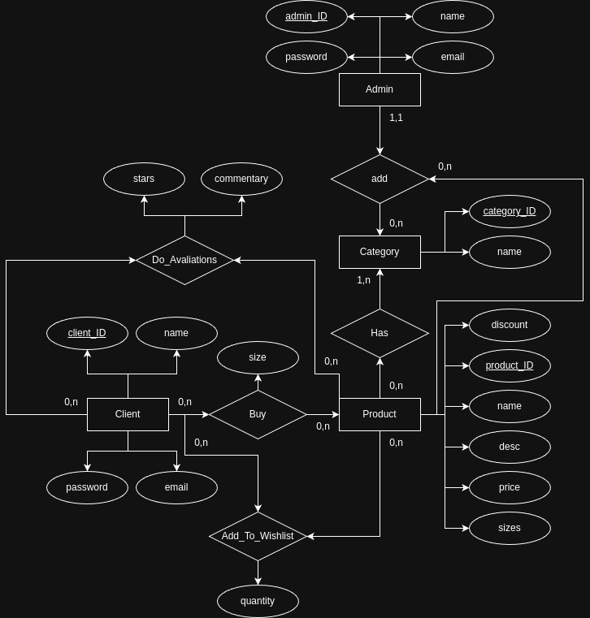
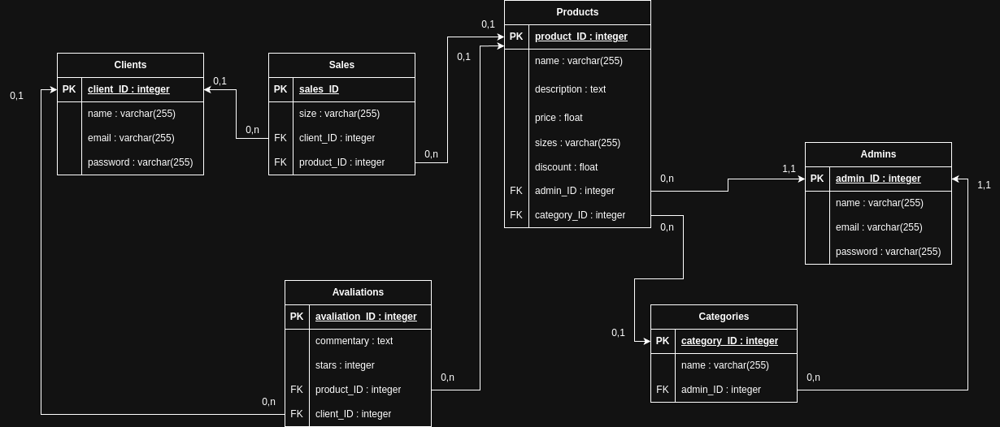
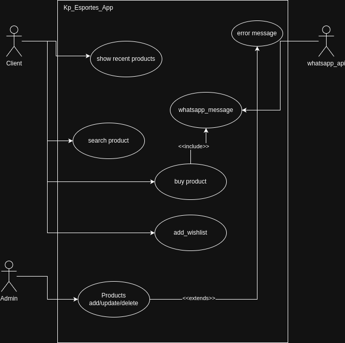
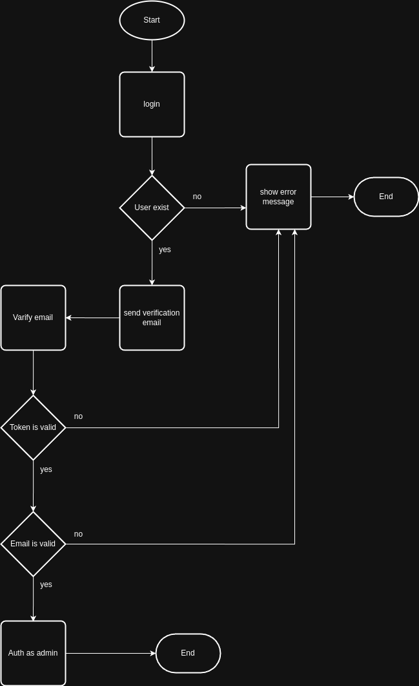

<h1>KpEsportes</h1>
Esse projeto é um freela fruto de uma parceria entre eu e meu amigo Lucas_Paz, onde eu (Alysson) fiquei responsavel pelo backend da aplicaçao e o lucas ficou responsavel pelo frontend. a aplicaçao é uma loja virtual de calçados KpEsportes, que possui uma loja fisica localizada em Jucás, Carius.

<h1>Database Docs</h1>
<h2>Model Entidade Relacionamento (MER)</h2>

<h2>Modelo Relacional (MR)</h2>

<h1>UML Docs</h1>
<h2>Use Case</h2>

<h1>Flow docs</h1>
<h2>Authentication flow chart</h2>

<h1>Endpoints</h1>

<h2>Authentication</h2>
<h3>/api/auth/admin/sendVerificationMail - POST</h3>

Esta rota é utilizada para um email email para a caixa de entrada da pessoa que esta querendo logar se como administrador, as informaçoes do admin e seu token de verificaçao serao salvos na tabela validation_email_tokens

<ul>
    <li>name - Obrigatorio, minimo de 3 carecteres, maximo de 20</li>
    <li>email - Obrigatorio, email valido, precisa ser unica na tabela de admins</li>
    <li>password - Obrigatorio, minimo de 8 caracteres, maximo de 16</li>
</ul>

<h3>/api/auth/admin/verifyEmail - GET</h3>

Ao enviar um email de verificaçao de email ele ira junto com um link, ao admin clicar no link ele sera redirecionado para uma pagina de verificaçao de email no frontend q tem a rota /auth/verifyemail, la vai ter um botao verificar email, que ao clicar nele um request sera enviado para essa rota q retorna com um token de acesso pra o admin

<ul>
    <li>token - Obrigatorio, precisa existir na tabela validation_mail_tokens</li>
    <li>email - Obrigatorio, precisa ser um email valido e existir na tabela validation_email_tokens</li>
</ul>

<h2>Categories</h2>

<h3>/api/category/add - POST</h3>

Esta rota serve para adicionar uma categoria

<ul>
    <li>name - Obrigatorio, minimo de 3 caracteres maximo de 25, e deve ser o unico na tabela categories</li>
</ul>

<h3>/api/category/delete/{id} - DELETE</h3>

Serve para deletar uma categoria, o id da categoria a ser deletada deve ser passada na uri, ao deletar uma categoria todos os produtos associados a ela tambem serao deletados

<ul>
    <li>id - Obrigatorio, deve ser numerico, deve existir na tabela categories</li>
</ul>

<h3>/api/category/all - GET</h3>

Retorna todas as categorias em forma de um array q esta presente no atributo categories do json retornado, cada casa do array é um objeto json equivalente a um objeto da classe KpEsportes/App/Domain/Model/Category

<h3>/api/category/update/{id} - PUT</h3>

Atualiza as informaçoes da categoria que tem o id igual ao id passado como parametro na uri

<ul>
    <li>id - Obrigatorio, numerico, e precisa existir na tabela categories</li>
    <li>name - Obrigatorio, minimo de 3 caracteres maximo de 25, e deve ser unico na tabela categories</li>
</ul>

<h2>Products</h2>

<h3>/api/product/add - POST</h3>

Esta rota serve para adicionar um novo produto, ela é protegida entao voce precisa estar autenticado como administrador

<ul>
    <li>name - É um campo obrigatorio minimo de 3 e maximo de 40 caracteres</li>
    <li>description - Obrigatorio minimo de 10 e maximo de 10000 caracteres</li>
    <li>price - É obrigatorio e precisa ser um valor numerico
    <li>discount - É obrigatorio e precisa ser uma valor numerico</li>
    <li>size - É obrigatorio, nao pode ser vazio e precisa vim no formato json</li>
    <li>image - É obrigatorio, precisa ser um arquivo valido e precisa ser do tipo jpeg, jpg, png ou gif</li>
    <li>category - É obrigatorio, precisa ser numerico e precisa existir no campo category_id na tabela categories</li>
</ul>

<h3>/api/product/update/{id} - POST</h3>

Essa rota serve para atualizar um produto, o campo imagem deve ser enviado como nulo caso a imagem permaneça a mesma

<ul>
    <li>id - É obrigatorio, deve ser numerico e deve existir na table products no campo product_id</li>
    <li>name - É obrigatorio, deve ter no minimo 3 e no maximo 40 caracteres e deve ser unico na tabela products com exceçao do registro com o product_id igual ao id do request</li>
    <li>description - É obrigatorio, deve ter no minimo 10 e no maximo 10000 caracteres</li>
    <li>price - É obrigatorio, deve ser numerico</li>
    <li>discount - É obrigatorio, deve ser numerico</li>
    <li>size - É obrigatorio, deve ser uma lista contendo todos os tamanhos</li>
    <li>image - Pode ser nulo, deve ser um arquivo valido, e deve ter um dos seguintes tipos jpeg, jpg, png ou gif</li>
    <li>category - É obrigatorio, precisa ser numerico e precisa existir na tabela categories no campo category_id</li>
</ul>

<h3>/api/product/recents?limit={?limit} - GET</h3>

Retorna os produtos em ordem de contraria á de inserçao, o parametro limit dita a quantidade maxima de produtos a ser retornado

<ul>
    <li>limit - Pode ser nulo, caso seja retornara todos os produtos, e precisa ser numerico</li>
</ul>

<h3>/api/product/find/{id} - GET</h3>

Retorna um produto especifico q tem o id correspondente ao id passado como parametro na uri

<ul>
    <li>id - Obrigatorio, numerico e precisa existir na tabela products no campo product_id</li>
</ul>

<h3>/api/product/delete/{id} - DELETE</h3>

Deleta um produto um produto do banco de dados

<ul>
    <li>id - É obrigatorio, e precisa existir na tabela products no campo product_id</li>
</ul>

<h3>/api/product/search?search={search} - GET</h3>

Retorna os produtos q tenho o nome ou categoria parecida com o valor do search q é passado no corpo da requisiçao

<ul>
    <li>search - É obrigatorio</li>
</ul>